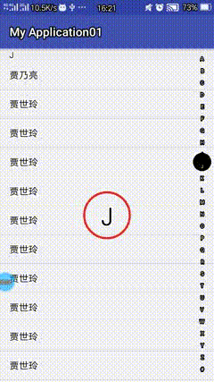

#横，竖屏 跑马灯
效果图gif

#实现仿通讯录核心是

###步骤一:
/**
     * 当手指触摸按下的时候改变字母背景颜色
     */
    @Override
    public boolean onTouchEvent(MotionEvent event) {
        switch (event.getAction()) {
            case MotionEvent.ACTION_DOWN:
            case MotionEvent.ACTION_MOVE:
                float y = event.getY();
                //关键点===获得我们按下的是那个索引(字母)
                int index = (int) (y / itemHeight);
                if (index != touchIndex)
                    touchIndex = index;
                //防止数组越界
                if (listener != null && 0 <= touchIndex && touchIndex <= words.length - 1) {
                    //回调按下的字母
                    listener.wordsChange(words[touchIndex]);
                }
                invalidate();
                break;
            case MotionEvent.ACTION_UP:
                //手指抬起,不做任何操作
                break;
        }
        return true;
    }

###步骤二:

/**
     * 更新中央的字母提示
     * @param words 首字母
     */
    private void updateWord(String words) {
        tv.setText(words);
        tv.setVisibility(View.VISIBLE);
        //清空之前的所有消息
        handler.removeCallbacksAndMessages(null);
        //500ms后让tv隐藏
        handler.postDelayed(new Runnable() {
            @Override
            public void run() {
                tv.setVisibility(View.GONE);
            }
        }, 500);
    }

    /**
     * @param words 首字母
     */
    private void updateListView(String words) {
        for (int i = 0; i < lists.size(); i++) {
            String headerWord = lists.get(i).getHeaderWord();
            //将手指按下的字母与列表中相同字母开头的项找出来
            if (words.equals(headerWord)) {
                //将列表选中哪一个
                list.setSelection(i);
                //找到开头的一个即可
                return;
            }
        }
    }

